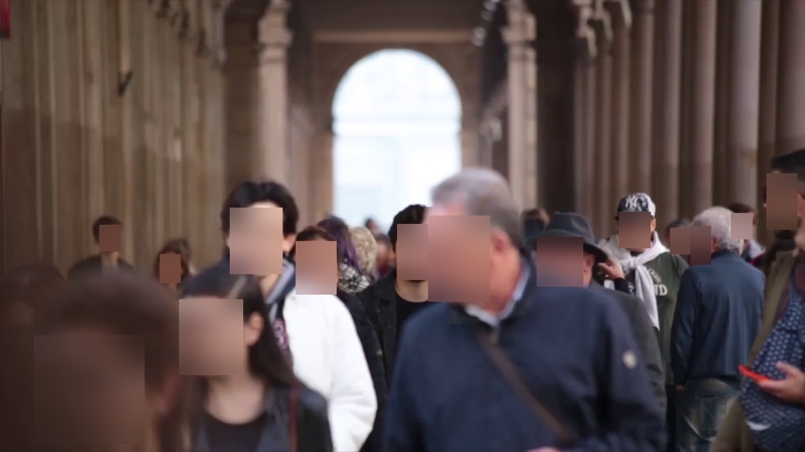

# Face Anonymization

A program for turning a movie into individual frames and blurring the faces of people appearing in it.

## Table of Contents

- [Descripition](#description)

- [Demo](#demo)

- [How to use program](#how-to-use-program)

## Description

This program was created to enable the creation of a database for the needs of Engineering Thesis.
The topic is the detection of cyclists in a video image using artificial intelligence.
However, due to the protection of personal data, the faces of all persons in the video (video frames) must be blurred.
Face recognition is based on DSFD. In this project, we use the [face-detection](https://pypi.org/project/face-detection/) package.
During the creation of the program, various types of face detection methods were used, only after using DSFD the effects were satisfactory.

## Demo
Below we present a single frame of the free movie:
<br />


The results obtained after starting the program are displayed here:
<br />


## How to use program
1. Clone the repository.
2. Unzip project.
3. Go to the folder where you unpacked this project.
4. Install all requaired modules: ```cv2, termcolor, face_detection```.
```
pip3 install install opencv-python / pip3 install termcolor / pip3 install face_detection
```
6. Please put all videos into the input folder.
7. Please run main.py

The program creates an output folder. Then, for each file with the .mp4 extension, a subfolder will be created and inside it another 2 subfolders (before and after). The before folder contains the video divided into frames. The after folder contains video frames with blurred faces.
